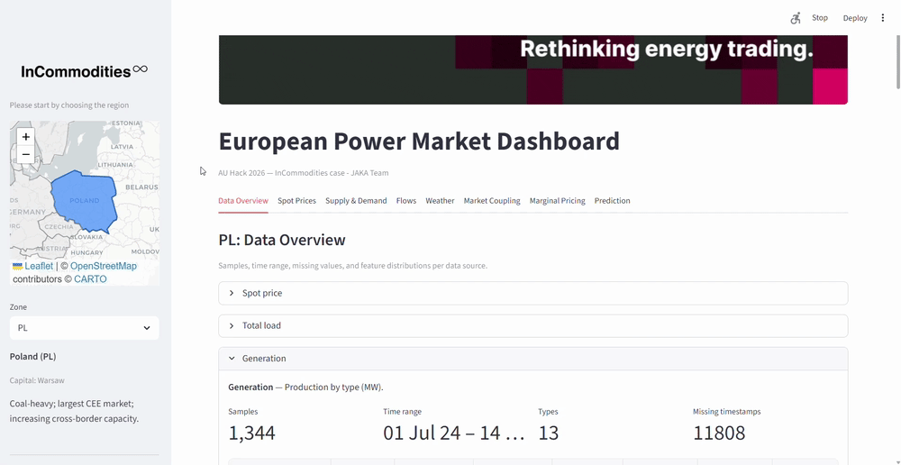
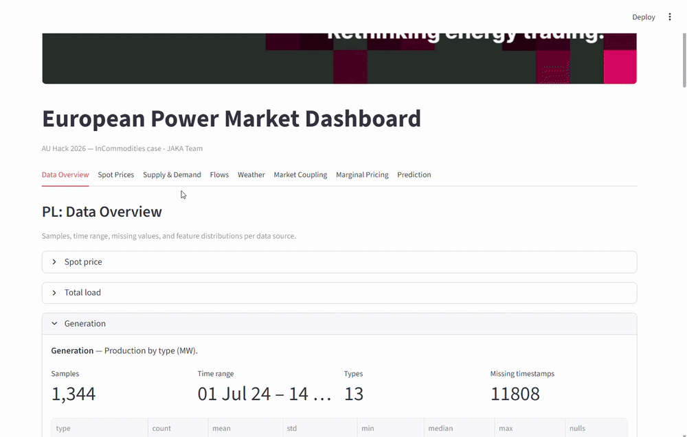
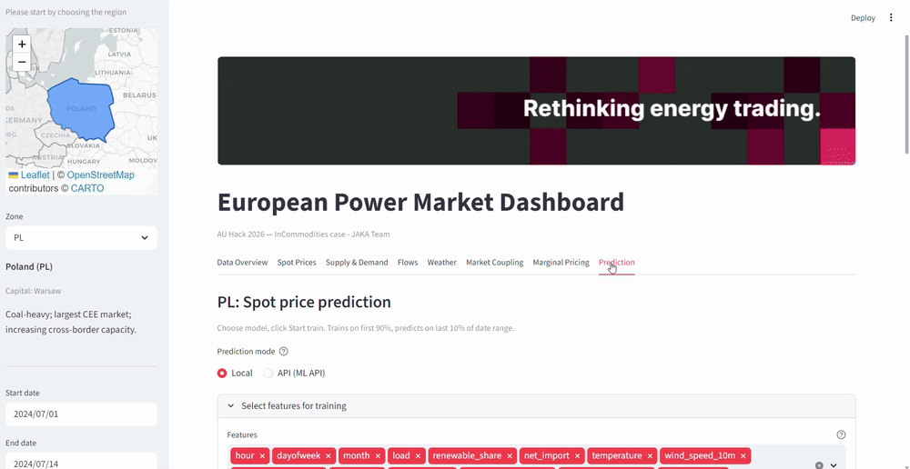
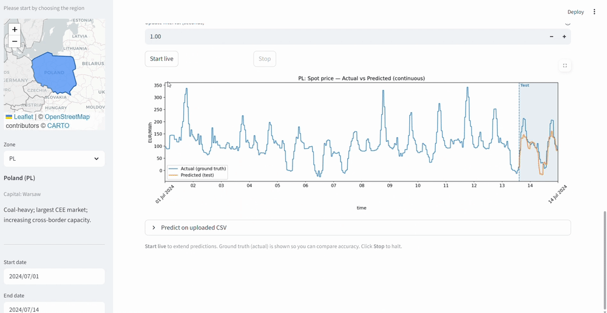

# European Power Market Dashboard

**AU Hack 2026 — InCommodities case** · JAKA Team

A Streamlit dashboard for exploring European electricity market data: spot prices, supply and demand, cross-border flows, weather fundamentals, market coupling, and spot price prediction from fundamentals.

---

## Project Overview

The European power market behaves like a complex distributed system. Spot prices, flows, and generation are driven by supply–demand balance, weather, and cross-border coupling. This project provides:

- **Interactive exploration** of day-ahead spot prices, generation mix, load, and physical flows across European bidding zones
- **Fundamental analysis** — merit order, duck curve, renewable penetration vs price, congestion detection
- **Market coupling insights** — price correlation, coupling events, arbitrage opportunities
- **Weather–price relationships** — temperature vs load, wind vs generation, cloud vs solar, temperature extremes vs price
- **Spot price prediction** — train models (RandomForest, XGBoost, LightGBM, CatBoost, stacking) on load, generation, weather, and flows

---

##  Visual Walkthrough

### 1. Pick your data: Regional Selection & Custom Uploads
Choose between bidding zones or bring your own data
<p align="center">
  
</p>

### 2. Fundamental Analysis: From Raw Data to Insights
Transform raw generation, load, and weather feeds into high-value charts
<p align="center">
  
</p>

### 3. Model Engineering: Feature Relevance & Training
Select the most impactful features and train your models
<p align="center">
  
</p>


### 4. Live Simulation: Validating the Forecast
Benchmark the ML pipeline against reality
<p align="center">
  
</p>


## Technologies & Methods

### Stack

- **Python 3.10+**
- **Streamlit** — dashboard UI
- **pandas, numpy** — data handling
- **matplotlib** — plotting
- **scikit-learn** — RandomForest, stacking, metrics
- **XGBoost, LightGBM, CatBoost** — gradient boosting models
- **FastAPI + uvicorn** — optional ML API for training/inference
- **Folium** — interactive zone map
- **Docker** — containerized deployment

### Data

- **Spot prices** — day-ahead electricity prices (EUR/MWh) per zone
- **Total load** — electricity consumption (MW)
- **Generation** — by fuel type (solar, wind, hydro, gas, coal, nuclear, etc.)
- **Physical flows** — cross-border imports/exports between zones
- **Weather** — temperature, wind speed, cloud cover (Open-Meteo style)

Data lives under `data/` with subfolders: `spot-price/`, `total-load/`, `generation/`, `flows/`, `weather/`. Set `DATA_ROOT` if using a different path.

### Methods

- **Feature engineering** — hour, dayofweek, month, load, renewable share, net import, weather variables
- **Temporal split** — train on first 80%, validate on 10%, test on last 10%
- **Multi-seed ensembling** — average predictions across seeds for stability
- **Stacking** — meta-models (Ridge, MLP) on base model predictions
- **Merit order** — generation stacked from cheapest (renewables) to most expensive (gas/oil)
- **Duck curve** — residual load shape on high-solar vs low-solar days
- **Congestion detection** — flows flatlining at capacity limits
- **Flow driver decomposition** — correlations of net import with price spread, wind, load, renewable share

---

## Quick Start

### Prerequisites

- Python 3.10+
- Data in `data/` (see structure above)

### Install

```bash
pip install -r requirements.txt
```

Or in editable mode:

```bash
pip install -e .
```

### Run the Dashboard

```bash
streamlit run dashboard/app.py
```

Open [http://localhost:8501](http://localhost:8501) in your browser.

---

## Running with Docker

### Local mode (default)

Run the dashboard as usual; training and inference run in-process. No Docker needed.

### API mode (ML service)

To offload training/inference to a separate service:

1. **Start the ML API:**
   ```bash
   docker compose up ml-api -d
   ```

2. **Run the dashboard locally:**
   ```bash
   streamlit run dashboard/app.py
   ```

3. In the **Prediction** tab, choose **API (ML API)** instead of **Local**. Train and predict via the API.

### Full stack (Docker Compose)

```bash
docker compose up --build
```

- **ML API:** http://localhost:8000  
- **Dashboard:** http://localhost:8501  

Run in background:

```bash
docker compose up --build -d
```

Stop services:

```bash
docker compose down
```

### Environment variables

| Variable     | Default              | Description                          |
|-------------|----------------------|--------------------------------------|
| `DATA_ROOT` | `./data`             | Path to data directory               |
| `MODEL_DIR` | `./models`           | Path for saved models (ML API)       |
| `ML_API_URL`| `http://localhost:8000` | ML API base URL (dashboard)       |

Copy `.env.example` to `.env` and adjust if needed.

---

## Using the Dashboard

### Sidebar

1. **Choose a zone** — Use the map or dropdown to select a bidding zone (e.g. DE, FR, DK1).
2. **Set date range** — Start and end dates filter most plots.
3. **Add custom zones** — Optional: add zones via the sidebar section.

### Tabs

| Tab | What it answers |
|-----|------------------|
| **Data Overview** | What data do we have, and is it complete? Distributions and time ranges per data type. |
| **Spot Prices** | What do spot prices look like? When do they spike, go negative, or become volatile? Peak vs off-peak spread. |
| **Supply & Demand** | How does supply meet demand? What drives the spot price? Why do renewables earn a profit? |
| **Flows** | How is power distributed between countries? What drives imports/exports? When do interconnectors hit capacity? |
| **Weather** | How does weather affect production and consumption? Temperature, wind, cloud cover. |
| **Market Coupling** | Which zones are price-linked? When do they couple or decouple? Where are arbitrage opportunities? |
| **Prediction** | Can we predict spot prices from fundamentals? Which features matter most per zone? |

### Prediction tab

1. Choose **Local** (in-process) or **API (ML API)** if the ML service is running.
2. Select a model: RandomForest (lightest), XGBoost, LightGBM, CatBoost, or Stacking (Ridge/MLP).
3. Click **Start train** — trains on first 90% of the date range, predicts on last 10%.
4. View metrics (MAE, RMSE, R²), prediction plot, and optional CSV upload for inference.

---

## Project Structure

```
auhack2026/
├── dashboard/           # Streamlit app and plots
│   ├── app.py           # Main layout, tabs, sidebar
│   ├── plots/           # Plot modules (spot_prices, supply_demand, flows, etc.)
│   ├── zone_map.py      # Interactive Folium map
│   └── ml_client.py     # Client for ML API
├── src/                 # Shared logic
│   ├── config.py        # DATA_ROOT, MODEL_DIR, ML_API_URL
│   ├── data_loader.py   # Load spot, load, generation, flows, weather
│   ├── features.py      # Feature engineering for prediction
│   ├── ml_trainer.py    # Train/predict (RF, XGB, LGB, CB, stacking)
│   └── zone_registry.py # Zone discovery (built-in + disk + custom)
├── ml_service/          # FastAPI ML service (optional)
│   ├── main.py          # /train, /predict, /health
│   └── ...
├── data/                # Input data (spot-price, total-load, generation, flows, weather)
├── models/              # Saved models (when using ML API)
├── docs/
│   └── RUNNING.md       # Detailed run instructions
└── requirements.txt
```

---

## License

For AU Hack 2026 / InCommodities case use.
